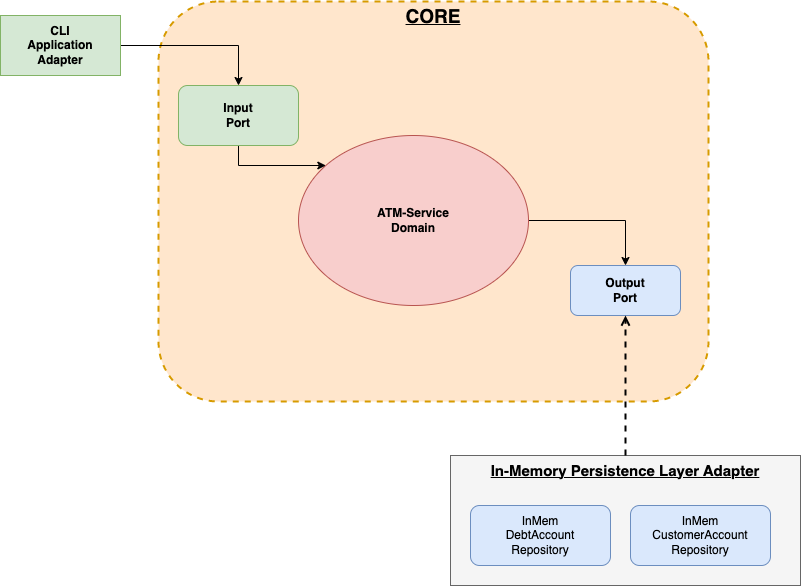

# ATM Simulator (Java 21)

A simple ATM-service application that capable of performing these following transactions:
1. login to an existing account (or creating a new one if it doesn't exist)
2. deposit an amount
3. transfer an amount to a target account
4. logout

This application is built using Java 21 while applying the `Hexagonal Architecture` to split the code layers into
some layers respectively for `core-domain` layer and the `application` layer.
By having this kind of layered-architecture we can protect our  business logic within the `core` domain layer
regardless of its application interface or any infrastructure layer such as database, framework, etc that we're going to use.
Here as an example, we're providing a `cli-application` as one of its application layer to interact with our user.
Later on, we can create another application layer (e.g., RESTful API, etc) using different framework available,
including persistence layer for various database available outside without fully interrupting our `core` domain
as long as we're following the same contract as defined within our `input port` and `output port`.



## Requirements

- JDK 21 available in `PATH`
- Maven 3.9+ available in `PATH`

Alternatively, you can use Docker to run it as a container. We provide a `Dockerfile` in the root directory.

## How to run

```sh
./start.sh
```

The program reads commands from standard input. Use `exit` or EOF to quit.

## How to run tests

```sh
./test.sh
```

Or directly with Maven:

```sh
mvn test
```

## Commands

- `login [name]`
- `deposit [amount]`
- `withdraw [amount]`
- `transfer [target] [amount]`
- `logout`

## Notes / Assumptions

- Amounts are treated as non-negative integers.
- State is in-memory only; each `./start.sh` run starts from a clean slate.
